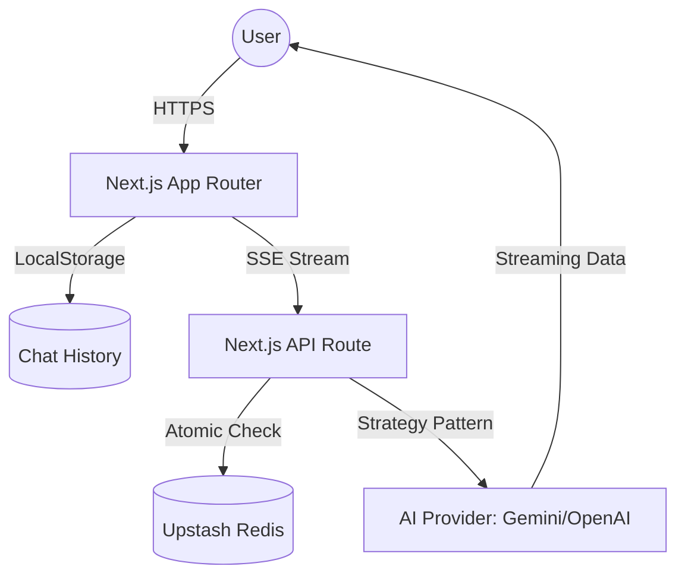

# 🏛️ PhiloGPT

**PhiloGPT** is a purpose-built AI philosophical guide designed to help you navigate life's challenges with the timeless wisdom of Marcus Aurelius, Seneca, and Epictetus. 

Built with a focus on privacy, speed, and architectural elegance, PhiloGPT combines a **stateless backend** with a **stateful client** to provide a seamless, serverless-native experience.

---

## 🏗️ System Architecture

PhiloGPT uses a hybrid state management system to ensure performance and scalability.



### **Core Design Patterns**
- **Strategy Pattern**: Abstracted AI providers allowing instant switching between Gemini and OpenAI.
- **Stateless Backend**: The server holds no session state, making it infinitely scalable on Vercel.
- **Stateful Client**: All chat history and session persistence live in the user's browser for maximum privacy.
- **Atomic Rate Limiting**: Uses **Lua scripting** inside Redis to provide an unbreakable sliding window barrier against abuse.

---

## 🛡️ Industrial-Strength Rate Limiting

Unlike basic rate limiters that reset on server restarts, PhiloGPT uses a **Persistent Sliding Window** algorithm:
- **Global Memory**: All server instances share a single source of truth via **Upstash Redis**.
- **Lua Atomicity**: The limit check and increment occur as a single atomic operation, preventing race conditions.
- **Sliding Window**: Provides a smooth experience by tracking individual request timestamps rather than fixed-minute blocks.

---

## 🚀 Getting Started

### **1. Prerequisites**
- Node.js 18+
- An [Upstash Redis](https://upstash.com) account (Free Tier)
- A [Google AI (Gemini)](https://aistudio.google.com/) or [OpenAI](https://openai.com/) API key

### **2. Setup Environment**
Create a `.env.local` file in the root directory:

```env
# AI Providers
GEMINI_API_KEY="your-gemini-key"
OPENAI_API_KEY="your-openai-key"

# Global Rate Limiting (Upstash)
UPSTASH_REDIS_REST_URL="https://your-db-url.upstash.io"
UPSTASH_REDIS_REST_TOKEN="your-rest-token-here"

# App Settings
AI_PROVIDER="gemini"
```

### **3. Installation**
```bash
npm install
npm run dev
```

---

## 🛠️ Tech Stack
- **Framework**: [Next.js 15+](https://nextjs.org) (App Router)
- **Styling**: [Tailwind CSS v4](https://tailwindcss.com) + [Lucide Icons](https://lucide.dev)
- **AI**: Google Generative AI (Gemini Flash)
- **Memory**: [Upstash Redis](https://upstash.com)
- **Streaming**: Server-Sent Events (SSE)

---

## 📜 Philosophy
PhiloGPT is guided by the *Dichotomy of Control*:
> "Some things are within our power, while others are not. Within our power are opinion, motivation, desire, aversion, and, in a word, whatever is our own doing; not within our power are our body, our property, reputation, office, and, in a word, whatever is not our own doing." — **Epictetus**

---
*Created with focus and reason.*
